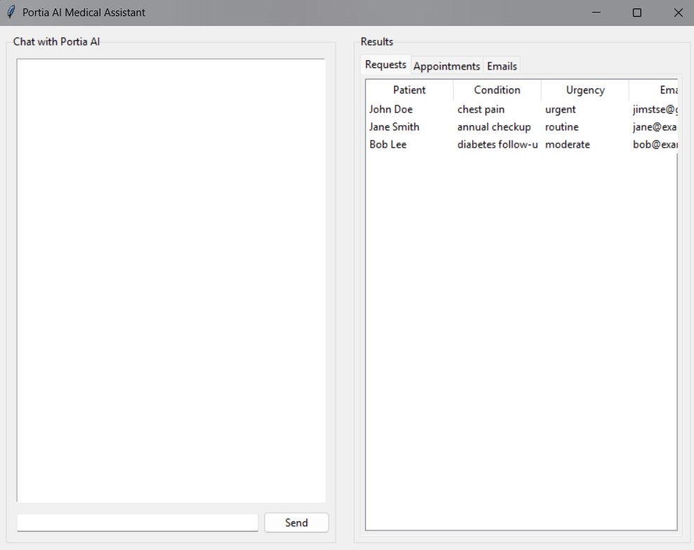

# Hackathon

## Introduction
This cutting-edge technology leverages Portia AI's technologies. It is the best tool to apply in the medical field. First, our product enabled the patient to schedule an online appointment. The system will helps to prioritise the patient based on the  situation of each patient and also inform the patient about their appointment.

## How to use
0. Ensure you have python 3.11 or higher installed.
1. Run the chatbot.py file

A window should open and looks like this:

The right shows the patient details and the left shows the chatbot

2. On the left, you can tell the chatbot to schedule appointments , prioritize, send email to the patients about their appointments and add requests from new patients.
3. Appointments could be easily scheduled and sent
